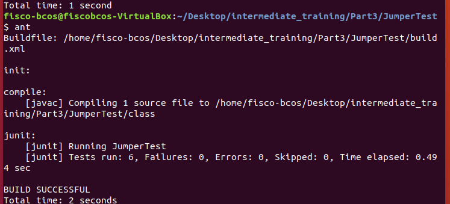

## JumperTest测试报告
### 姓名：黄善恒 学号：17343046

----
- 根据```designreport```内容，创建了6个测试函数，分别如下
1. 测试当```Jumper```出现在边界处且面朝界外的情况，预测结果是调用```turn()```调转方向而不改变其```Location```属性，代码如下：
```java
        @Test
	public void test1(){ // test when bug at grid[0,0]-> it would turn 45 
		ActorWorld world = new ActorWorld();
		Jumper jumper = new Jumper();
		world.add(new Location(0, 0), jumper);
		jumper.act();
		assertEquals(0, jumper.getLocation().getRow());
		assertEquals(0, jumper.getLocation().getCol());
		assertEquals(45, jumper.getDirection());
	}
```
2. 测试当```Jumper```离边界还有一个空位时的情况，预测结果是调用```moveTo```只移动一格位置即移动到边界处，代码如下：
```java
        @Test
	public void test2(){// test when bug at grid[1,0]-> it would move to[0,0] 
		ActorWorld world = new ActorWorld();
		Jumper jumper = new Jumper();
		world.add(new Location(1, 0), jumper);
		jumper.act();
		assertEquals(0, jumper.getLocation().getRow());
		assertEquals(0, jumper.getLocation().getCol());
	}
```
3. 测试当```Jumper```前两格处有```Rock```对象时的情况，预测结果是调用```turn()```函数转向而不调用```moveTo```移动一格位置，代码如下：
```java
        @Test
	public void test3(){ // test when the bug at grid[2,0] and there are rock in grid[0,0]->it would turn 45
		ActorWorld world = new ActorWorld();
		Jumper jumper = new Jumper();
		Rock rock = new Rock();
		world.add(new Location(2, 0), jumper);
		world.add(new Location(0, 0), rock);
		jumper.act();
		assertEquals(2, jumper.getLocation().getRow());
		assertEquals(0, jumper.getLocation().getCol());
		assertEquals(45, jumper.getDirection());
	}
	
```
4. 测试当```Jumper```前两格处有```Flower```对象是的情况，预测结果是调用```moveTo```移动两格取代```Flower```对象，代码如下:
```java
        @Test
	public void test4(){// test when the bug at grid[2,0] and there are flower in grid[0,0]-> it will take place of the flower
		ActorWorld world = new ActorWorld();
		Jumper jumper = new Jumper();
		Flower flower = new Flower();
		world.add(new Location(2, 0), jumper);
		world.add(new Location(0, 0), flower);
		jumper.act();
		assertEquals(0, jumper.getLocation().getRow());
		assertEquals(0, jumper.getLocation().getCol());
	}
```
5. 测试当一条线上存在2个```Jumper```对象且两个对象均可移动2格的情况，预测结果是两个```Jumper```对象都调用```moveTo```移动到两格处，代码如下:
```java
	@Test
	public void test5(){ // test when there are two jumper at the same line->if can, both jump two cells
		ActorWorld world = new ActorWorld();
		Jumper jumper1 = new Jumper();
		Jumper jumper2 = new Jumper();
		world.add(new Location(2, 0), jumper1);
		world.add(new Location(4, 0), jumper2);
		jumper1.act();
		jumper2.act();
		assertEquals(0, jumper1.getLocation().getRow());
		assertEquals(0, jumper1.getLocation().getCol());
		assertEquals(2, jumper2.getLocation().getRow());
		assertEquals(0, jumper2.getLocation().getCol());
	}
```
6. 测试当一条线上存在两个```Jumper```对象且为首的对象不可移动的情况，预测结果是两个```Jumper```对象均调用```turn()```转向而不改变```Location```属性，代码如下:
```java
@Test 
	public void test6(){ // test when there are two jumpers and the former can't move->the other can't move too
		ActorWorld world = new ActorWorld();
		Jumper jumper1 = new Jumper();
		Jumper jumper2 = new Jumper();
		world.add(new Location(0, 0), jumper1);
		world.add(new Location(2, 0), jumper2);
		jumper1.act();
		jumper2.act();
		assertEquals(0, jumper1.getLocation().getRow());
		assertEquals(0, jumper1.getLocation().getCol());
		assertEquals(45, jumper1.getDirection());
		assertEquals(2, jumper2.getLocation().getRow());
		assertEquals(0, jumper2.getLocation().getCol());
		assertEquals(45, jumper2.getDirection());
		
	}
```
- 编写完成后输入```ant```命令执行，执行结果如下，全部测试函数运行成功即与预测情况一致：


